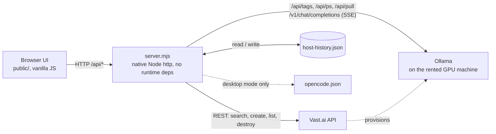
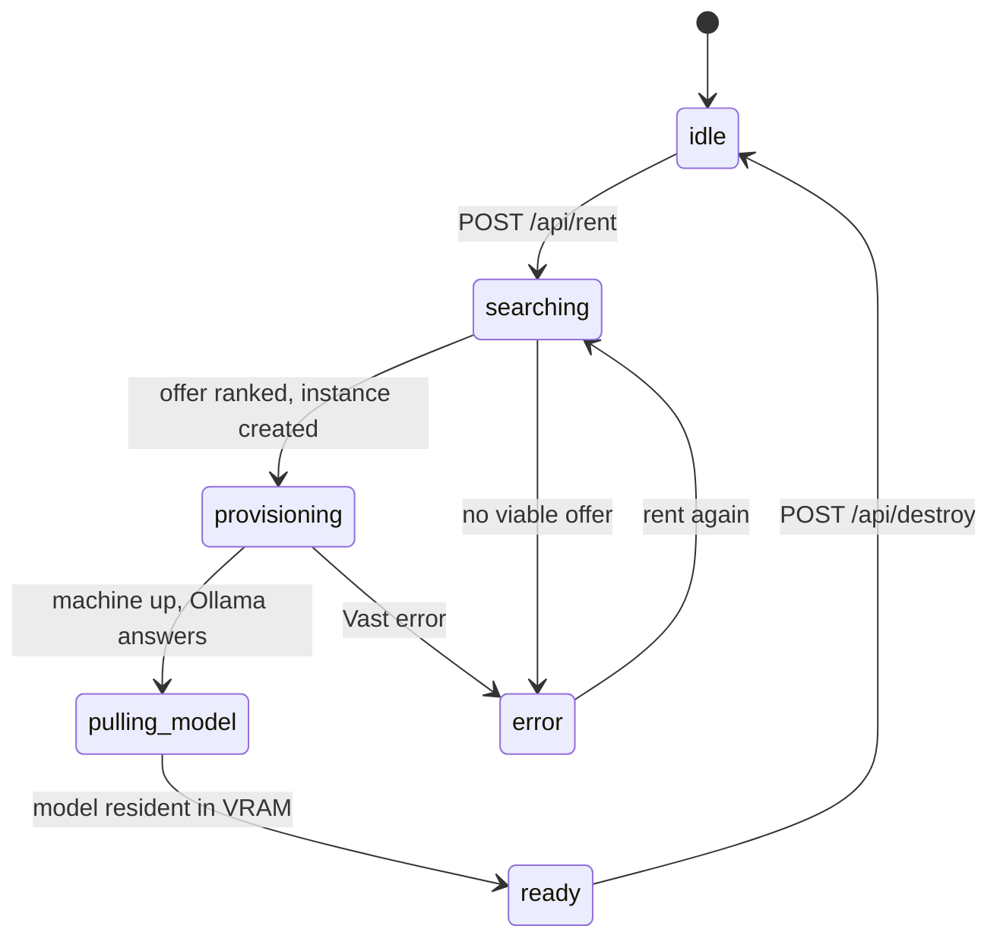

# Velocity GPU

Rent a GPU on [Vast.ai](https://vast.ai), serve an open-weight LLM with [Ollama](https://ollama.com), and chat with it from a single page.

It automates the whole "I need a bigger GPU for an hour" workflow: find a suitable machine, boot Ollama on it, pull the model, wait until the model is actually resident in VRAM, then proxy a streaming chat to it. It can also write the rented endpoint into your [opencode](https://opencode.ai) config so the box works as a coding-agent backend.

> Proof of concept. It rents real GPUs that **bill by the hour**. See [Status and limitations](#status-and-limitations).

## Why

A 14B to 32B model does not fit on a laptop, and renting a GPU by the hour is cheap. Doing it by hand is not: offers disappear between search and rent, some hosts crash on start, a multi-GB model download takes minutes, and a forgotten instance keeps billing. This project is the glue that handles those failure modes.

## What it does

Flow on screen: **pick a model, rent, watch the deployment live, chat.**

1. Searches Vast.ai for a single-GPU machine that fits the model (VRAM, disk, reliability, bandwidth, price cap, Turing or newer).
2. Ranks the offers, skipping hosts that failed before and preferring hosts that worked before, and retries with the next offer if one vanishes.
3. Starts the official `ollama/ollama` image, then pulls the GGUF model over HTTP and warms it into VRAM in the background.
4. Reports progress through a small phase machine (`searching`, `provisioning`, `pulling-model`, `ready`) with an uptime timer.
5. Streams chat completions through the server to the rented box.
6. Destroys the instance on demand, optionally flagging the host as bad.

The catalog has five models, all quantized GGUF files from the official Ollama library that fit on one GPU: Qwen2.5 7B, 14B and 32B, Llama 3.1 8B, and Gemma 2 27B.

## Architecture



Rental lifecycle, as seen by the UI:



`pulling_model` is the `pulling-model` phase. While in it, `GET /api/status` runs a read-only four-state probe (`down`, `no-model`, `loading`, `ready`) and fires the pull and the warmup once each.

## Engineering notes

- **Zero-dependency server.** `server.mjs` is native `node:http`, global `fetch` and `node:fs/promises`: a route table, a static file handler with a path-traversal guard, and an SSE proxy. There are no runtime dependencies.
- **Dependency injection for testability.** `createApp` receives the Vast client, the rental store, the host history, `fetch` and the opencode writer as arguments. File and network I/O in the other modules is injectable the same way. `server.mjs` is the only composition root, so the whole app is tested without a real GPU, API key or open port.
- **Readiness by observation.** An early version forced a one-token generation with a short timeout to check readiness; aborting it cancelled the model load and the box never warmed up. Now a dedicated warmup request loads the model with a long timeout, and the probe only observes `/api/ps`. Pulls use `stream: true` because a silent connection is dropped by Vast's port proxy.
- **Ephemeral offers.** Offers are ranked as a list, and `no_such_ask` or "is not available" errors move on to the next candidate instead of failing the rental. Any other error aborts.
- **Host memory.** Good and bad hosts are keyed by the stable `machineId`, not the recycled offer id. A host that boots fine again is redeemed automatically. State is a JSON file with pure merge functions and injectable I/O, and a corrupted file is never overwritten.
- **Cost safety.** Layered on purpose: a per-model price cap in both the query and the ranking, a Turing-or-newer compute-capability floor (modern CUDA images ship no Volta kernels, so those hosts would bill while crashing), an exact GPU count, one rental at a time, and a boot-time reconciler that re-adopts a still-billing instance after a restart.
- **One source of truth for limits.** `resolveModelLimits` derives the context window and the output cap, and feeds the UI spec sheet, the `OLLAMA_CONTEXT_LENGTH` set on the box (Ollama's `/v1` endpoint ignores the client-declared window and would silently truncate), and the opencode config.
- **Capability-gated desktop mode.** The server, not the browser, decides whether it may write `opencode.json`. The Electron shell starts it in `desktop` mode, bound to loopback on an ephemeral port. The merge preserves the user's existing config, and a small JSONC parser handles comments and trailing commas.

## Tech stack

- Node.js 20+ (ESM), no runtime dependencies
- Vanilla JavaScript, HTML and CSS front end, no build step
- Electron 33 for the optional desktop shell
- Vitest with V8 coverage
- Vast.ai REST API, Ollama (`/api` and OpenAI-compatible `/v1`), GGUF models

## Getting started

Requires Node.js 20 or newer and a Vast.ai API key (Account, then API Keys) on an account with some credit.

```bash
git clone https://github.com/Cristopher-Martinez/velocitygpu.git
cd velocitygpu
npm install          # also downloads Electron; set ELECTRON_SKIP_BINARY_DOWNLOAD=1 to skip it
cp .env.example .env # then set VAST_API_KEY
```

Web version, at http://localhost:5174:

```bash
node --env-file=.env server.mjs   # or: VAST_API_KEY=... npm start
```

Desktop version (loads `.env` itself, picks a free local port, and can apply the config to opencode for you):

```bash
npm run desktop
```

| Variable | Default | Purpose |
| --- | --- | --- |
| `VAST_API_KEY` | none | Vast.ai API key. Stays on the server and never reaches the browser. |
| `PORT` | `5174` | Port of the web version. |
| `VELOCITY_MODE` | `web` | `desktop` enables opencode auto-config. Set by the Electron shell. |
| `OPENCODE_CONFIG` | `~/.config/opencode/opencode.json[c]` | Config file written by the opencode sync. |
| `VELOCITY_HOST_HISTORY` | `~/.config/velocitygpu/host-history.json` | Where good and bad hosts are remembered. |

Remember to destroy the instance when you are done: it bills until you do.

## Testing

```bash
npm test
```

241 tests in 11 suites, with `src/` coverage around 99% for statements and lines, 100% for functions and 96% for branches.

Coverage is gated at 95% for statements, branches, functions and lines over `src/`. `server.mjs` is bootstrap wiring and is covered by a startup smoke test instead. The suites run the real modules with injected fakes for the Vast API, Ollama, the filesystem and timers, so no test needs a GPU, an API key or internet access.

## End-to-end run (spends money)

`e2e/run-e2e.mjs` drives the real modules against Vast.ai: it rents a machine, starts Ollama, pulls and warms the model, asks it one question, validates the answer, and destroys the instance. Destruction is guaranteed by `try/finally` and `SIGINT`/`SIGTERM` handlers, but confirm in the Vast console anyway.

```bash
VAST_API_KEY=... npm run e2e                           # default model: qwen2_5-7b
E2E_MODEL=qwen2_5-32b npm run e2e -- --keep            # heavier model, leave it running
```

| Variable | Default | Purpose |
| --- | --- | --- |
| `E2E_MODEL` | `qwen2_5-7b` | Catalog id to deploy. |
| `E2E_MAX_DPH` | `2.0` | Price cap in $/h; aborts instead of renting a pricier machine. |
| `E2E_READY_MS` | `1200000` | Timeout for the model to become ready (20 minutes). |
| `--keep` | off | Do not destroy the instance at the end. |

It is not part of CI.

## Project structure

```
server.mjs            composition root: real dependencies, then listen
src/
  app.mjs             request handler and routes, all dependencies injected
  vastClient.mjs      Vast.ai REST client (account, offers, instances)
  provisioner.mjs     offer query, offer ranking, instance-creation body
  models.mjs          model catalog and context/output limits
  rentalStore.mjs     in-memory rental state, phase derivation, readiness probe
  ollamaClient.mjs    streaming model pull and VRAM warmup
  reconciler.mjs      re-adopts live instances after a restart
  hostHistory.mjs     persisted good/bad host memory
  opencodeSync.mjs    merges the provider into opencode.json / opencode.jsonc
  runtime.mjs         desktop vs web mode
public/               single-page UI
electron/             desktop shell (main process and preload)
e2e/run-e2e.mjs       real-GPU end-to-end run
__tests__/            one Vitest suite per module
```

## API

| Method | Path | Purpose |
| --- | --- | --- |
| GET | `/api/environment` | Runtime mode and whether auto-config is available |
| GET | `/api/models` | Model catalog with resolved context and output limits |
| GET | `/api/account` | Vast.ai account balance |
| POST | `/api/rent` | Search, rank and rent a machine for `{ modelId }` |
| GET | `/api/status` | Current phase; also drives the background pull and warmup |
| POST | `/api/chat` | Streaming chat proxy to the box's `/v1/chat/completions` |
| POST | `/api/opencode-sync` | Write the endpoint and model into opencode (desktop only) |
| POST | `/api/destroy` | Destroy the instance; `{ failed: true }` also bans the host |
| GET | `/api/hosts` | Good and bad host history |
| POST | `/api/hosts/forget` | Remove a host from either list |

## Status and limitations

This is a proof of concept, not a hardened service.

- **One rental at a time**, held in memory. After a restart the reconciler re-adopts a live instance, but anything else is lost.
- **No authentication on the app server.** The web version listens on all interfaces, so do not expose it. The desktop version binds to loopback only.
- **The rented Ollama endpoint is plain HTTP with no auth**, reachable by anyone who finds the IP and port. The UI warns about it.
- **No idle shutdown.** The machine bills until you destroy it.
- **Cold starts take minutes.** Pulling a multi-GB model is the slow part.
- **The front end builds some markup with `innerHTML`** from the server's catalog and host history. That is fine for trusted data, and would need escaping before showing untrusted input.
- **Only Ollama is implemented.** The `engine` field in the catalog is a placeholder for other runtimes, and every model currently runs on a single GPU.

## License

[MIT](LICENSE)
